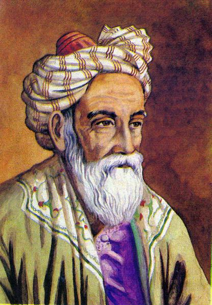

# Questions and Answers

### Why base it on the Persian calendar?

It is the most accurate calendar designed. I'd also argue that it is the most elegant. Basing the calendar on astronomical observations of the northward equinox is not only scientifically sound, but on some level even poetic. [Omar Khayyâm](https://en.wikipedia.org/wiki/Omar_Khayyam) was after all both an astronomer and a poet.

> Ah, but my Computations, People say,  
> Reduced the Year to better reckoning? – Nay  
> 'Twas only striking from the Calendar  
> Unborn To-morrow, and dead Yesterday.

_From Edward FitzGerald's English translation [The Rubâiyât of Omar Khayyâm](https://en.wikipedia.org/wiki/Rubaiyat_of_Omar_Khayyam)._

### Why does the calendar year begin at the northward equinox?

The year being reborn in spring is an idea that resonates deeply with people in many cultures. We have a long history of celebrating the coming of spring around northward equinox (for example [Nowruz](https://en.wikipedia.org/wiki/Nowruz), [Holi](https://en.m.wikipedia.org/wiki/Holi), [Falles](https://en.wikipedia.org/wiki/Falles), [Marzanna](https://en.wikipedia.org/wiki/Marzanna#Traditions), [Dísablót](https://en.wikipedia.org/wiki/D%C3%ADsabl%C3%B3t), [Teotihuacán](https://en.wikipedia.org/wiki/Spring_equinox_in_Teotihuac%C3%A1n) and various [South/Southeast Asian solar New Year](https://en.wikipedia.org/wiki/South_and_Southeast_Asian_solar_New_Year) traditions) — often symbolizing rebirth or fertility, often involving bonfires or burning of effigies. (At least in the northern hemisphere, where approximately 90% of us live. Apologies to the people of the southern hemisphere.)

There is also an astronomical reason for preferring the northward equinox over other reference points, [as explained by Simon Cassidy](https://www.hermetic.ch/cal_stud/cassidy/howlong.htm).

### Why 8 "months" and 9-day "weeks"?

To answer this, one should first answer the question "Why 12 months and 7-day weeks?", the common division of the year in many calendars. The first calendars were lunar calendars, tracking the easily observed phases of the Moon. A full lunar cycle is just under 30 days (currently 29.53 days on average). Over time, our attention turned to the stars and the Sun, as our understanding of astronomy grew. Eventually, agriculture and trade brought the need for a calendar that better followed the seasons. The Egyptian solar calendar is thought to be the first to abandon the lunar cycle and instead focus on Earth's cycle around the Sun. Still, it divided the solar year into 12 months of 30 days — maybe to ease the transition from the lunar calendar? The 7-day week is harder to explain. We know that the number 7 held a special significance to the Babylonians and Sumerians. Maybe it represented the 5 visible celestial bodies plus the Sun and the Moon?

Being a purely solar calendar, this calendar does not attempt to unify the Moon's cycle around Earth with Earth's cycle around the Sun. Nor does it try to unify the 7-day week with the calendar year. By not being tied to such constraints, it is able to achieve advantages not possible in traditional calendars.

8 "months" was chosen because 45 days is cleanly divisible by 9 to achieve "weeks" of `3 * 3` days, a [very flexible and powerful construct](https://www.hermetic.ch/cal_stud/ltc/ltc.htm#advantages). While one could achieve the same by only using 4 quarters of 90 calendar days, practicality demands smaller "months". 8 "months" of the year and 9 "weekdays" are also small enough sets for their names to be easily memorized, an important consideration. While 45 days are 15 days more than a 30-day month, it is not an unreasonably large period.

There is also an elegance in having 360 calendar days divided by two three times over, like cells dividing. The result is an even and balanced division of the year, with intercalary days distributed throughout and 40 "weeks" of `3 * 3` days.

To summarize: The advantages gained by dividing the year into 8 "months" and 40 "weeks" outweigh the disadvantage of being unfamiliar. A new calendar should not strive to uphold the rigid requirements of yesterday, but meet the demands of our ever dynamic societies.

### Why not 12/10/etc months?

12 "months" of exactly 30 calendar days would be possible in this calendar. However, one would lose the advantages gained by dividing the "month" into an integer number of "weeks" of `3 * 3` days. One would also need 12 new names to avoid confusion with the traditional 12 months.

10 "months" of 36 calendar days is not cleanly divisible by 4 — a quarter would not have an integer number of "months". Other divisions of 360 are either incompatible with 4 quarters and 9-day "weeks" (important features of this calendar) or produce too large or too small "months".

### Why have intercalary quarter days?

360 calendar days leaves 5 (or 6 in leap years) intercalary days. Having 4 equal quarters representing the 4 astronomical seasons enables the intercalary days to be distributed throughout the year, instead of lumping them all together in a mini-period at the end. This also makes the length of a quarter as close as possible to `365 / 4`.

An intercalary quarter day is considered the _zeroth_ day of its quarter, distinguishing it from the ordinary calendar days. These _zero-days_, representing the equinoxes and solstices, may be incorporated into traditions and festivals that take place around these astronomical events, having been of great importance to humans since ancient times.

Note that the actual instant of an equinox or solstice does not necessarily occur on a _zero-day_, as the [astronomical seasons](https://en.wikipedia.org/wiki/Season#Astronomical) are of uneven length. They also gradually change over time, making adherence to the actual astronomical seasons impossible for a well-balanced perennial calendar.

### Why place the extra day(s) at the end of the year?

After 4 quarters have passed, the remaining one or two days before the next calendar year begins are intercalary _transition days_, representing the transition from the old year to the new. The cultural significance of this may vary. For example, it could be a time for reflection and forgiveness.

Having the extra day(s) at the end of the year is a natural consequence of this being an observational calendar. The first day of a calendar year is simply determined by when the northward equinox occurs. Placing the extra day(s) anywhere else in the year would greatly complicate the calendar.

### Is the calendar secular? Religious?

It is absolutely neutral to this question. By being tied to the northward equinox, the calendar can be both scientifically precise and religiously relevant.

While not recommended, it is possible to ignore the proposed 9-day "week" and Human Era epoch, opting instead to retain the traditional 7-day week and Anno Domini epoch of the Gregorian calendar.

### You didn't answer my question!

[Create an issue](https://github.com/joakim/calendar/issues/new) and I'd be happy to answer as best as I can.
